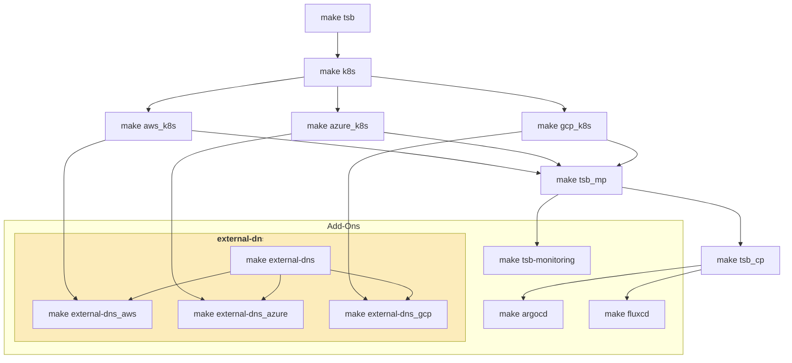

# Tetrate Service Bridge Sandbox

### Deploy Tetrate Service Bridge Demo on Azure Kubernetes Service (AKS), Google Kubernetes Engine (GKE) and/or Elastic Kubernetes Service (EKS) using Terraform

---

## About

The intention is to create a go-to demo from deploying underlying infra environment to deploying MP and CP and additional addons around use-cases.

## Overview

The `Makefile` in this directory provides ability to fast-forward to any point of the automated provisioning of the TSB demo



# Getting Started

## Prerequisites

- terraform >= 1.3.6
- (optional) AWS role configured and assumed (Route53 is used for TSB MP FQDN)
- (optional) Azure role configured and assumed
- (optional) GCP role configured and assumed `gcloud auth application-default login`
- please refer for the Cloud [Tagging Requirements](https://github.com/tetrateio/tetrate/blob/master/cloud/docs/gcp/labels.md)
  ```s
       "tetrate:owner"    = var.tetrate_owner
       "tetrate:team"     = var.tetrate_team
       "tetrate:purpose"  = var.tetrate_purpose
       "tetrate:lifespan" = var.tetrate_lifespan
       "tetrate:customer" = var.tetrate_customer
  ```
## Setup

1. Clone the repo

```bash
git clone https://github.com/tetrateio/tetrate-service-bridge-sandbox.git
```

2. Copy `terraform.tfvars.json.sample` to the root directory as `terraform.tfvars.json`

Please refer to [tfvars collection](/tfvars_collection) for more examples, i.e. tested options.

```json
{
    "k8s_clusters": {
        "aws": [
            {
                "region": "eu-west-1",
                "tetrate": {
                    "management_plane": true
                },
                "addons": {
                    "argocd": {
                        "enabled": true
                    }
                }
            }
        ],
        "azure": [
            {
                "region": "eastus",
                "tetrate": {
                    "control_plane": true
                },
                "addons": {
                    "argocd": {
                        "enabled": true
                    }
                }
            }
        ],
        "gcp": [
            {
                "region": "us-west1",
                "tetrate": {
                    "control_plane": true
                },
                "addons": {
                    "argocd": {
                        "enabled": true
                    }
                }
            }
        ]
    },
    "name_prefix": "<YOUR UNIQUE PREFIX NAME TO BE CREATED>",
    "tags": {
        "tetrate_owner": "Change me! (https://github.com/tetrateio/tetrate/blob/master/cloud/docs/misc/tags.md)",
        "tetrate_team": "Change me! (https://github.com/tetrateio/tetrate/blob/master/cloud/docs/misc/tags.md)"
    },
    "tetrate": {
        "fqdn": "<YOUR UNIQUE PREFIX NAME TO BE CREATED>.sandbox.tetrate.io",
        "image_sync_apikey": "<TSB_REPO_APIKEY>",
        "image_sync_username": "<TSB_REPO_USERNAME>",
        "organization": "tetrate",
        "password": "Tetrate123",
        "version": "1.7.2"
    }
}
```

### More [tfvars](/tfvars_collection):

| Links                                                                                                                   | Description                                                 |
| :---------------------------------------------------------------------------------------------------------------------- | ----------------------------------------------------------- |
| [mp-aks-cp-1aks-2gke-terraform.tfvars.json.sample](/tfvars_collection/mp-aks-cp-1aks-2gke-terraform.tfvars.json.sample) | MP on AKS, CP on 1xAKS, 2xGKE                               |
| [mp-eks-cp-1aks-1eks-2gke.tfvars.json.sample](/tfvars_collection/mp-eks-cp-1aks-1eks-2gke.tfvars.json.sample)           | MP on EKS, CP on 1xAKS, 1xEKS, 2xGKE                        |
| [mp-gke-cp-1aks-1eks-2gke.tfvars.json.sample](/tfvars_collection/mp-gke-cp-1aks-1eks-2gke.tfvars.json.sample)           | MP on GKE, CP on 1xAKS, 1xEKS, 2xGKE                        |
| [mp-gke-cp-1aks-2gke.tfvars.json.sample](/tfvars_collection/mp-gke-cp-1aks-2gke.tfvars.json.sample)                     | MP on GKE, CP on 1xAKS, 2xGKE                               |
| [mp-gke-cp-3gke.tfvars.json.sample](/tfvars_collection/mp-gke-cp-3gke.tfvars.json.sample)                               | MP on GKE, CP on 3xGKE                                      |
| [mp-gke-cp-2aks-2eks-2gke.tfvars.json.sample](/tfvars_collection/mp-gke-cp-2aks-2eks-2gke.tfvars.json.sample)            | MP on GKE, CP on 2xAKS, 2xEKS, 2xGKE within the same region |

## Usage

a) Make sure your cloud CLIs (gcloud, aws, az) are logged in in your current shell.
```bash
# Gcloud example
gcloud auth application-default login
```

All `Make` commands should be executed from root of repo as this is where the `Makefile` is.


b) Stand up a complete demo

```bash
# Build complete demo
make all
```

c) Decouple Demo or Deploy in Stages

```bash
# setup underlying clusters, registries, jumpboxes
make k8s

# deploy tsb management plane
make tsb_mp

# onboard deployed clusters (dataplane/controlplane)
make tsb_cp
```

d) Advanced customization

```bash
# provide a custom path to variables file
make all tfvars_json=./path/to/my/environment.tfvars.json

# provide commands to execute, but don't run the deployment pipeline
make all dry_run=true

# enable TF_LOG, for more details please refer to: https://developer.hashicorp.com/terraform/internals/debugging
make all tf_log=DEBUG
```

The completion of the above steps will result in:

- all the generated outputs will be provided under `./outputs` folder
- output kubeconfig files for all the created aks clusters in format of: $cluster_name-kubeconfig
- output IP address and private key for the jumpbox (ssh username: tsbadmin), using shell scripts login to the jumpbox, for example to reach gcp jumpbox just run the script `ssh-to-gcp-jumpbox.sh`

## Deployment Scenarios

* [Infrastructure Staging](./infra/README.md)<br>
* [TSB Management Plane Rollout](./tsb/README.md#tsb_mp)<br>
* [TSB Control Plane Cluster Onboarding](./tsb/README.md#tsb_cp)<br>

## Use Cases and Addons

* [ArgoCD GitOps](./addons/README.md#argocd)
* [FluxCD GitOps](./addons/README.md#fluxcd)
* [external-dns](./addons/README.md#external-dns)

## Destroy

When you are done with the environment, you can destroy it by running:

```bash
make destroy
```

For a quicker destroy for development purposes, you can:

- manually delete the clusters via CLI or web consoles
- run `make destroy_local` to delete the terraform data

## Dev Environment (Tetrate Internal)

[If you want to provision the latest master build](./DEVELOPMENT_BUILD.md)

## Usage notes

- Terraform destroys only the resources it created (`make destroy`)
- Terraform stores the `state` across workspaces in different folders locally
- Cleanup of aws objects created by K8s load balancer services (ELB+SGs) is automated, but may require manual effort.
- When using GCP, it is possible to use the DNS of the current project instead of the shared one. This may
  be convenient if you don't have permissions to create DNS records in the shared DNS project. To have the
  DNS records created in your project, just use any `fqdn` you want that ends in `.private`. Note that
  `.private` domains won't work in multi-cluster scenarios, since XCP Edges need a public name to connect to
  Central.
  Alternatively, if you own a domain that you can point to your GCP project, you can use any `fqdn` as long
  as it does _not_ have the shared DNS suffix (gcp.sandbox.tetrate.io). In this case a public DNS zone will be
  created in the project for the configured DNS domain.

### Repository structure

| Directory | Description |
| --------- | ----------- |
| [addons](addons) | Terraform modules to deploy optional add-ons such as ArgoCD or the TSB monitoring stack. |
| [gitops](gitops) | Example application configurations to be used with the ArgoCD addon. |
| [infra](infra) | Infrastructure deployment modules. Provisioning of networking, jumpboxes and k8s clusters. |
| [modules](modules) | Generic and reusable terraform modules. These should not contain any specific configuration. |
| [outputs](outputs) | Terraform output values for the provisioned modules. |
| [tsb](tsb) | TSB Terraform modules to deploy the TSB MP and TSB CPs. |
