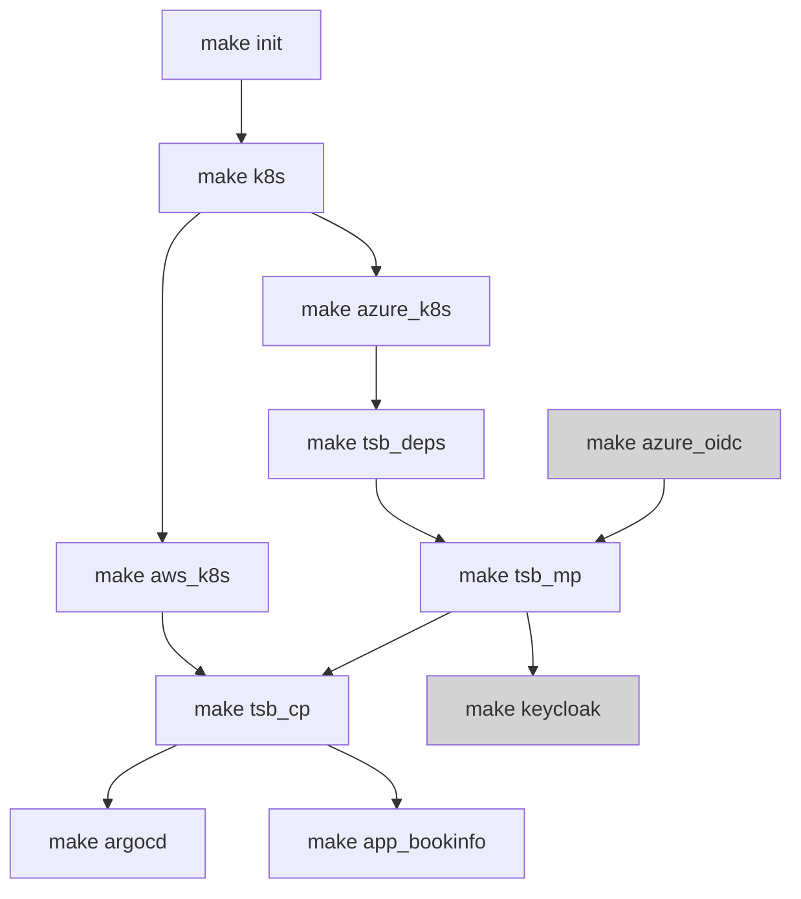

# Tetrate Service Bridge Sandbox

## Deploy Tetrate Service Bridge Demo on Azure Kubernetes Service (AKS) and Elastic Kubernetes Service (EKS) using Terraform

The intention is to create azure-go-to demo... from deploying MP and CP using helm til having an application demo setup using standard and gitops approach...and of course variablize the world "completely" is work in progress...

The `Makefile` in this directory provides automated provisioning of k8s clusters with TSB installed on Azure.



The setup consists of

- module.azure_base - deploys resource group, vnet and acr
- module.azure_jumpbox - deploys jumpbox, pushes tsb repo to acr
- module.azure_k8s - deploys k8s cluster for MP and N-number of CPs(\*) leveraging AKS

- module.es - deploys ECK on MP k8s cluster
- module.cert-manager - deploys cert-manager on MP k8s cluster
- module.argocd - deploys argoCD
  bookinfo demo app using ArgoCD with related TSB components
  grpc demo app using ArgoCD with related TSB components
- module.keycloak-helm - deploys keycloak
- module.keycloak-provider - configs keycloak for JWT-based external authorization demo
- module.app_bookinfo - deploys bookinfo

- module.tsb_mp - responsible for TSB MP setup using Helm chart
- module.tsb_cp - responsible for TSB CP setup using Helm chart
- module.aws_route53_register_fqdn - responsible for TSB Public FQDN setup

## Requirements

- terraform >= 1.0.0
- configured and assumed Azure role
- configured and assumed AWS role
- (optional) configured and assumed GCP role `gcloud auth application-default login`

## Usage

terraform.tfvars

```

name_prefix = "<YOUR UNIQUE PREFIX NAME TO BE CREATED>
tsb_image_sync_username = "cloudsmith-username"
tsb_image_sync_apikey = "cloudsmith-apikey"
tsb_fqdn = "<YOUR UNIQUE NAME TO BE CREATED>.cx.tetrate.info"
tsb_version = "1.5.0-EA2"
tsb_password = "Tetrate123"
azure_region = "East US"
aws_region = "eu-west-1"
aws_eks_app_clusters_count = 0
azure_aks_app_clusters_count = 1

```

To stand up the demo continue with the steps below:

```bash
# setup modules
make init
# setup underlying clusters
make k8s
# deploy TSB MP (to include required dependecies)
make tsb_mp
# deploy TSB CP using Helm chart on the target cluster
make tsb_cp cluster_id=0 cloud=azure # MP cluster is targetted to be onboarded as Tier1
make tsb_cp cluster_id=1 cloud=azure
make tsb_cp cluster_id=0 cloud=aws
# deploy apps using ArgoCD on the target cluster
make argocd cluster_id=1 cloud=azure
make argocd cluster_id=0 cloud=aws
```

The completion of the above steps will result in:

- output TSB management plane endpoint
- output kubeconfig files for all the created aks clusters in format of: $cluster_name-kubeconfig
- output IP address and private key for the jumpbox (ssh username: tsbadmin)

### ArgoCD

- deploys bookinfo app under gitops-bookinfo namespace and exposes it over the ingress gateway as gitops-bookinfo.tetrate.io
- argocd is exposed using `LoadBalancer` type `k get svc -n argocd argo-cd-argocd-server`, the username is admin and password is the specified TSB admin password

When you are done with the environment, you can destroy it by running:

```bash
make destroy
```

### Usage notes

- Terraform destroys only the resources it created.
- Terraform stores the `state` locally
- variablize the world "completely" is work in progress...
