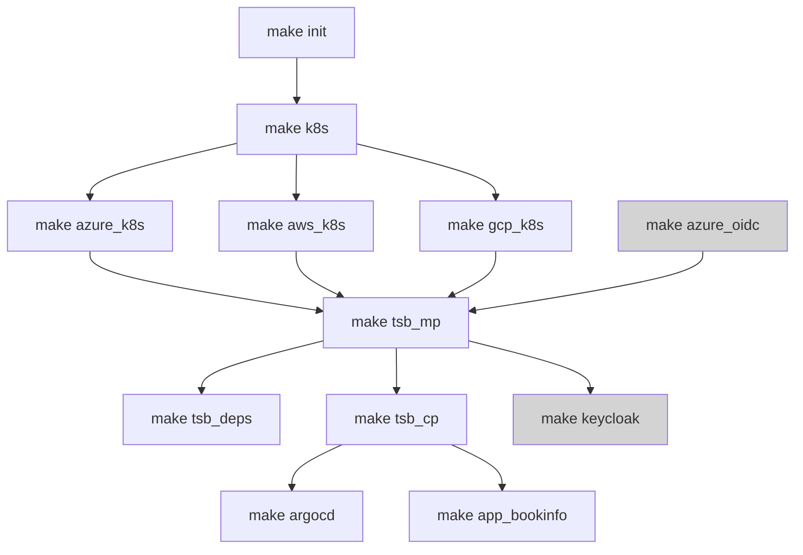

# Tetrate Service Bridge Sandbox

## Deploy Tetrate Service Bridge Demo on Azure Kubernetes Service (AKS), Google Kubernetes Engine (GKE) and/or Elastic Kubernetes Service (EKS) using Terraform

The intention is to create azure-go-to demo... from deploying MP and CP using helm til having an application demo setup using standard and gitops approach...and of course variablize the world "completely" is work in progress...

The `Makefile` in this directory provides automated provisioning of k8s clusters with TSB installed on Azure.



The setup consists of

- module.azure_base - deploys resource group, vnet and acr
- module.azure_jumpbox - deploys jumpbox, pushes tsb repo to acr
- module.azure_k8s - deploys k8s cluster for MP and N-number of CPs(\*) leveraging AKS

- module.es - deploys ECK on MP k8s cluster
- module.cert-manager - deploys cert-manager on MP k8s cluster
- module.argocd - deploys argoCD
  bookinfo demo app using ArgoCD with related TSB components
  grpc demo app using ArgoCD with related TSB components
- module.keycloak-helm - deploys keycloak
- module.keycloak-provider - configs keycloak for JWT-based external authorization demo
- module.app_bookinfo - deploys bookinfo

- module.tsb_mp - responsible for TSB MP setup using Helm chart
- module.tsb_cp - responsible for TSB CP setup using Helm chart
- module.aws_route53_register_fqdn - responsible for TSB Public FQDN setup

## Requirements

- terraform >= 1.0.0
- configured and assumed Azure role
- configured and assumed AWS role
- (optional) configured and assumed GCP role `gcloud auth application-default login`

## Usage

Copy `terraform.tfvars.json.sample` to the root directory as `terraform.tfvars.json`

```json
{
    "name_prefix": <YOUR UNIQUE PREFIX NAME TO BE CREATED>,
    "tsb_fqdn": "<YOUR UNIQUE PREFIX NAME TO BE CREATED>.cx.tetrate.info",
    "tsb_version": "1.5.0",
    "tsb_image_sync_username": "TSB_REPO_USERNAME",
    "tsb_image_sync_apikey": "TSB_REPO_APIKEY",
    "tsb_password": "Tetrate123",
    "tsb_mp": {
        "cloud": "gcp",
        "cluster_id": 0
    },
    "tsb_org": "tetrate",
    "aws_k8s_regions": [
    ],
    "azure_k8s_regions": [
    ],
    "gcp_k8s_regions": [
        "us-west1",
        "us-east1"
    ]
}
```

To stand up the demo just do `make tsb`

or if you want to decouple the steps...

```bash
# setup underlying clusters, registries, jumpboxes
make k8s
# deploy tsb management plane
make tsb_mp
# onboard deployed clusters
make tsb_cp
# deploy argocd on the management cluster
make argocd
```

The completion of the above steps will result in:

- all the generated outputs will be provided under `./outputs` folder
- output kubeconfig files for all the created aks clusters in format of: $cluster_name-kubeconfig
- output IP address and private key for the jumpbox (ssh username: tsbadmin), using shell scripts login to the jumpbox, for example to reach gcp jumpbox just run the script `ssh-to-gcp-jumpbox.sh`

### ArgoCD

- deploys bookinfo app under gitops-bookinfo namespace and exposes it over the ingress gateway as gitops-bookinfo.tetrate.io
- argocd is exposed using `LoadBalancer` type `k get svc -n argocd argo-cd-argocd-server`, the username is admin and password is the specified TSB admin password

When you are done with the environment, you can destroy it by running:

```bash
make destroy
```

### Usage notes

- Terraform destroys only the resources it created.
- Terraform stores the `state` locally
- variablize the world "completely" is work in progress...
