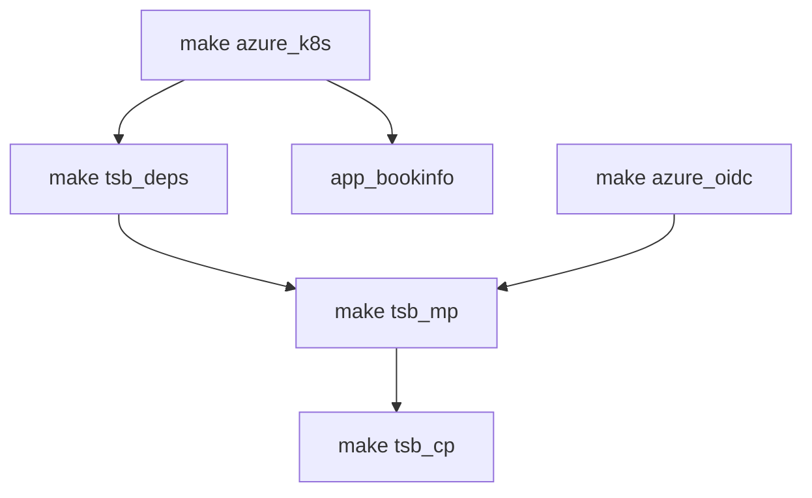

# Deploy Tetrate Service Bridge Demo on Azure Kubernetes Service (AKS) using Terraform

The intention is to create azure-go-to demo... from deploying MP and CP using helm til having an application demo setup using standard and gitops approach...and of course variablize the world "completely" is work in progress...

The `Makefile` in this directory provides automated provisioning of k8s clusters with TSB installed on Azure. 


The setup consists of

* module.azure_base     - deploys resource group, vnet and acr
* module.azure_jumpbox  - deploys jumpbox, pushes tsb repo to acr
* module.azure_k8s      - deploys k8s cluster for MP and N-number of CPs(*) leveraging AKS

* module.es             - deploys ECK on MP k8s cluster
* module.cert-manager   - deploys cert-manager on MP k8s cluster
* module.argocd         - deploys argoCD

* module.tsb_mp         - responsible for TSB MP setup using Helm chart
* module.tsb_cp         - responsible for TSB CP setup using Helm chart
* module.aws_dns        - responsible for TSB Public FQDN setup

## Requirements

- terraform >= 1.0.0
- configured and assumed Azure role
- configured and assumed AWS role
## Usage

terraform.tfvars

```
name_prefix = "juggles"
location    = "eastus"
cidr        = "172.16.0.0/16"
image-sync_apikey = "cloudsmith-apikey"
image-sync_username = "cloudsmith-username"
tsb_fqdn            = "toa.cx.tetrate.info"
tsb_version         = "1.5.0-internal-rc1"
tsb_password        = "Tetrate123"
app_clusters_count  = "1"
```

To stand up the demo continue with the steps below:
```bash
# setup underlying clusters
make azure_k8s
# deploy TSB dependecies such as elastic, cert-manager
make tsb_deps
# deploy TSB MP using Helm chart
make tsb_mp
# deploy TSB CP using Helm chart
make tsb_cp cluster_id=0
make tsb_cp cluster_id=1
# deploy bookinfo application
make app_bookinfo
```

The completion of the above steps will result in:
- output TSB management plane endpoint
- output kubeconfig files for all the created aks clusters in format of: $cluster_name-kubeconfig
- output IP address and private key for the jumpbox (ssh username: tsbadmin)

When you are done with the environment, you can destroy it by running:

```bash
make destroy
```

### Usage notes
- Terraform destroys only the resources it created.
- Terraform stores the `state` locally
- variablize the world "completely" is work in progress...
