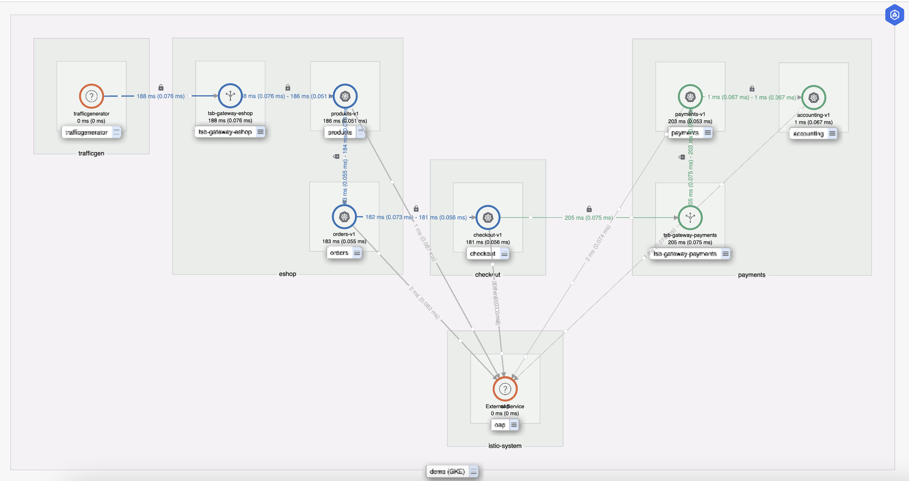

# eShop demo application

This is a demo application that can be used to play with tenancy in TSB as well as the
telemetry parts of the product.

It consists of two applications:

* `eshop`: Contains the `eshop` and `checkout` namespaces.
* `payments`: Contains the `payments` namespaces.

The `payments` service is configured to introduce a 200ms latency, and the `checkout`
service is configured to fail 20% of the requests.  
The `eshop` ingress gateway is also
configured to rate-limit to a max of 3 requests per second per unique client address.   
Hierarchical policies are set to limit access to the `payments` application from the `checkout`
security group.



By default, it uses a demo LDAP as the Identity provider, and the following users
are configured. However, custom users can be designated as owners of the different applications
by configuring the environment variables as explained in the table at the end.

* `nacx/nacx-pass`: Is a Creator on the eshop tenant.
* `zack/zack-pass`: Is the owner of the eshop workspace.
* `wusheng/wusheng-pass`: Is the owner of the payments workspace.

## Deploy the application

This assumes access to a TSB installation. The installation script will deploy all
the obs-tester instances, configure TSB, the ingress gateways, and install a
traffic generator.

You can deploy it with the following command, from the repository root:

```bash
make eshop
```

You can configure the following environment variables as well to customize the installation:

| Variable | Default value | Description |
|---|---|---|
| eshop_host | eshop.tetrate.io | Hostname to expose the main eshop app in an ingress gateway |
| payments_host | payments.tetrate.io | Hostname to expose the main payments app in an ingress gateway |
| tenant_owner | nacx | Username of the owner of the eShop tenant |
| eshop_owner | zack | Username of the owner of the eShop workspace |
| payments_owner | wusheng | Username of the owner of the payments workspace |
